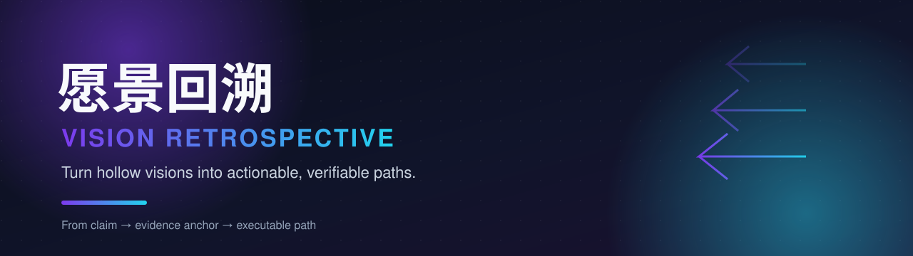
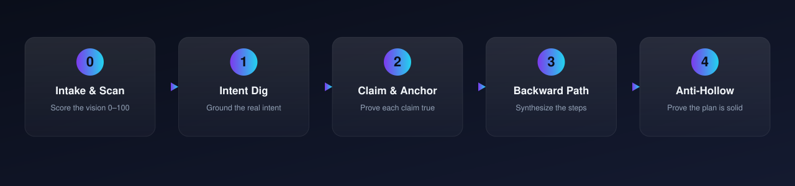
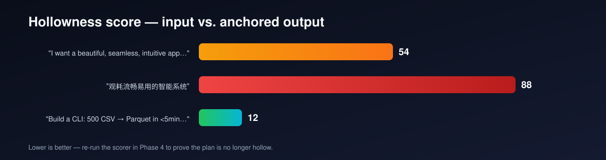

<p align="center">
  
</p>

<p align="center">
  
  
  
  
</p>

---

**Vision Retrospective (愿景回溯)** is a scientific AI skill that turns *hollow*
visions into *actionable, verifiable* implementation paths.

> **The problem.** *Vision-Driven Development* asks the AI to write a vision, then
> implement it. The gap between a vague vision and working code gets filled with
> plausible but ungrounded content — the output looks complete and is hollow.
>
> **The fix.** *Vision Retrospective* moves **backward**: it treats the vision as a
> *claim to verify*, anchors every claim to observable evidence, then decomposes
> only the anchored claims into a verifiable path.

| | Vision-Driven Development | Vision Retrospective |
|---|---|---|
| Direction | Forward (assume → build) | Backward (claim → verify → build) |
| Gap-filling | Model improvises plausibly | Evidence anchors force specificity |
| Success check | Subjective ("looks good") | Measurable (re-run hollowness score) |
| Typical result | Pretty but hollow | Executable and verifiable |

---

## The VR Loop

<p align="center">
  
</p>

| Phase | Name | Output |
|-------|------|--------|
| 0 | **Intake & Hollow-Scan** | Hollowness score (0–100) + flagged terms |
| 1 | **Intent Excavation** (回溯意图) | Grounded vision, resolved assumptions |
| 2 | **Claim Decomposition & Anchoring** (拆解+锚定) | Claims → verification anchors |
| 3 | **Backward Path Synthesis** (回溯路径) | Epic → Task → Atomic-Step path |
| 4 | **Anti-Hollow Verification** (反空洞校验) | Solid plan + score delta |

A healthy run shows a **falling hollowness score**: input (high) → output (low).

## See it work

<p align="center">
  
</p>

The deterministic scorer (pure standard library, no ML) powers both Phase 0 and
Phase 4:

```bash
# English
python vision-retrospective/scripts/hollowness_scorer.py \
  --text "I want a beautiful, seamless, intuitive app that helps people."

# Chinese
python vision-retrospective/scripts/hollowness_scorer.py \
  --text "做一个美观流畅易用的智能系统，帮助用户提升体验。"

# Machine-readable, or use as a CI gate (fail if score > 60)
python vision-retrospective/scripts/hollowness_scorer.py --text "..." --json
python vision-retrospective/scripts/hollowness_scorer.py --text "..." --fail-above 60
```

## Features

- **Deterministic hollowness detection** — flags vague adjectives (beautiful,
  intuitive, 美观, 流畅…) and the four missing verifiability dimensions:
  measurable metric, beneficiary, concrete action, success language.
- **Backward methodology** — each claim is traced to the evidence that proves it,
  then decomposed only once anchored.
- **Score delta proof** — report the input→output score drop as objective evidence
  the plan is no longer hollow.
- **Language-agnostic** — works on English and Chinese input out of the box.
- **CI-ready** — `--fail-above N` exits non-zero so hollow specs can block a build.

## Install

**As a user skill** (recommended for personal use):

```bash
unzip vision-retrospective.zip -d ~/.workbuddy/skills/
```

**As a project skill** (share with a repo's collaborators):

```bash
unzip vision-retrospective.zip -d .workbuddy/skills/
```

Then mention a vision or "愿景回溯" and the skill triggers automatically.

## Repository structure

```
Vision-Retrospective-Skill/
├── README.md                         # this page
├── vision-retrospective.zip          # distributable package
├── vision-retrospective/
│   ├── SKILL.md                      # skill entry point (the VR Loop)
│   ├── scripts/
│   │   └── hollowness_scorer.py      # deterministic 0–100 detector
│   ├── references/
│   │   ├── methodology.md            # full method + worked example
│   │   └── templates.md              # artifact templates
│   └── assets/
│       └── vision_retrospective_report.md  # report scaffold
└── assets/                           # README visuals (SVG)
```

## Worked example

<details>
<summary>From a hollow vision to a verifiable path</summary>

**Input (Hollow, score 54):**
> "I want to build a beautiful, seamless, intuitive app that helps people be more
> productive."

**Phase 0** flags `beautiful`, `seamless`, `intuitive` and missing `measurable_metric`
+ `success_language`.

**Phase 1** (targeted questions): who is "people"? what is "productive"? →
*freelance writers*; productivity = *publish 2× more drafts per week with less
admin time*.

**Phase 2** claims + anchors:

| Claim | Verification Anchor |
|-------|--------------------|
| Writers draft faster | ≥80% of test writers publish ≥2 drafts/week vs. 1 before |
| Low admin overhead | Non-writing time drops from 40% to <15% |

**Phase 3** vertical MVP slice: *write → autosave → publish to one platform* with a
measurable timer; then broaden to multi-platform + analytics.

**Phase 4** re-score the plan → **18 (Solid)**. Delta **54 → 18** reported.

</details>

## License

MIT — see [LICENSE](LICENSE).
